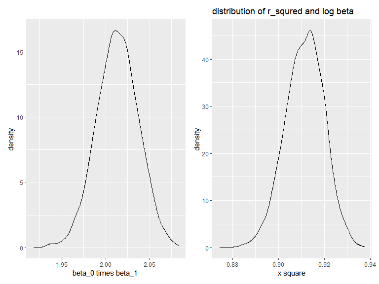

p8105_hw6_zj2357
================
Zekai Jin (zj2357)
2022-11-29

First of all, we should include the libraries we are using.

``` r
library(tidyverse)
library(p8105.datasets)
library(patchwork)
library(modelr)

knitr::opts_chunk$set(
  message  = FALSE,
  warning = FALSE,
  fig.width = 8, 
  fig.height = 6,
  out.width = "90%"
)
```

# Problem 1

Downloading the dataset

``` r
weather_df = 
  rnoaa::meteo_pull_monitors(
    c("USW00094728"),
    var = c("PRCP", "TMIN", "TMAX"), 
    date_min = "2017-01-01",
    date_max = "2017-12-31") %>%
  mutate(
    name = recode(id, USW00094728 = "CentralPark_NY"),
    tmin = tmin / 10,
    tmax = tmax / 10) %>%
  select(name, id, everything())
```

``` r
boot_straps = 
  tibble(
    strap_num = 1:100,
    strap_samp = rerun(100, sample_frac(weather_df, replace = TRUE))
  ) %>%
  mutate(
    models = map(.x=strap_samp, ~lm(tmax~tmin, data = .x)),
    beta = map(.x=models,~pull(broom::tidy(.x),estimate)),
    rsq =  map(.x=models,~pull(broom::glance(.x),r.squared)),
    beta_sq = map(beta,prod)
  ) %>%
  select(strap_num,rsq,beta_sq) %>%
  mutate(
      rsq = as.numeric(rsq),
      beta_sq = as.numeric(beta_sq)
  )
```

plotting

``` r
rsq_plot = 
  boot_straps %>%
  ggplot(aes(x=rsq)) +
  geom_density() +
  xlab("x square")

beta_plot = 
  boot_straps %>%
  ggplot(aes(x=beta_sq)) +
  geom_density() +
  xlab("beta_0 times beta_1 ")

beta_plot + rsq_plot
```



CI

``` r
conf_int =
  boot_straps %>%
  pivot_longer(
    rsq:beta_sq,
    names_to = "variable",
    values_to = "value"
  ) %>%
  group_by(variable) %>%
  summarise(
    lower_CI = quantile(value,0.025),
    higher_CI = quantile(value,0.975)
  )
conf_int
```

    ## # A tibble: 2 × 3
    ##   variable lower_CI higher_CI
    ##   <chr>       <dbl>     <dbl>
    ## 1 beta_sq     7.18      7.75 
    ## 2 rsq         0.895     0.926

# Problem 2

``` r
rm(list = ls())

homi_df = 
  read_csv("data/homicide-data.csv") %>%
  mutate(
    city_state = str_c(city, ", ", state),
    solved = !disposition %in% c("Closed without arrest","Open/No arrest"),
    victim_age = as.numeric(victim_age)
  ) %>%
  filter(
    !city_state %in% c("Dallas, TX", "Phoenix, AZ", "Kansas City, MO", "Tulsa, AL"),
    victim_race %in% c("Black", "White")
  ) %>%
  select(uid,city_state,solved,victim_race, victim_age, victim_sex) %>%
  na.omit()
```

`Baltimore, MD`

``` r
logi_fit = 
  homi_df %>%
  filter(city_state == "Baltimore, MD") %>%
  glm(solved~ victim_race+ victim_age+ victim_sex, data = ., family = "binomial")

logi_fit %>%
  broom::tidy() %>%
  filter(term == "victim_sexMale") %>%
  mutate(
    conf_low = estimate-1.96*std.error,
    conf_high = estimate+1.96*std.error
  )  %>%
  select(term,estimate,conf_low,conf_high)
```

    ## # A tibble: 1 × 4
    ##   term           estimate conf_low conf_high
    ##   <chr>             <dbl>    <dbl>     <dbl>
    ## 1 victim_sexMale   -0.854    -1.13    -0.584

other cities

``` r
logi_fit =
  homi_df %>%
  nest(data = c(uid,solved, victim_age,victim_race,victim_sex)) %>%
  mutate(
    model = map(.x = data, ~glm(solved~ victim_race+ victim_age+ victim_sex, data = .x, family = "binomial")),
    estimate = map(.x=model, ~filter(broom::tidy(.x),term == "victim_sexMale"))
  ) %>%
  unnest(estimate) %>%
  mutate(
    conf_low = estimate-1.96*std.error,
    conf_high = estimate+1.96*std.error
  )  %>%
  select(city_state,estimate,conf_low,conf_high)

logi_fit
```

    ## # A tibble: 47 × 4
    ##    city_state        estimate conf_low conf_high
    ##    <chr>                <dbl>    <dbl>     <dbl>
    ##  1 Albuquerque, NM  0.570       -0.186    1.32  
    ##  2 Atlanta, GA      0.0000771   -0.380    0.381 
    ##  3 Baltimore, MD   -0.854       -1.13    -0.584 
    ##  4 Baton Rouge, LA -0.964       -1.56    -0.363 
    ##  5 Birmingham, AL  -0.139       -0.555    0.276 
    ##  6 Boston, MA      -0.395       -1.03     0.244 
    ##  7 Buffalo, NY     -0.653       -1.24    -0.0670
    ##  8 Charlotte, NC   -0.123       -0.585    0.338 
    ##  9 Chicago, IL     -0.891       -1.09    -0.692 
    ## 10 Cincinnati, OH  -0.917       -1.44    -0.390 
    ## # … with 37 more rows

plotting

``` r
logi_fit %>%
  mutate(
    city_state = fct_reorder(city_state, -estimate)
  ) %>%
  ggplot(aes(x = estimate, y = city_state)) +
  geom_point() +
  geom_errorbar(aes(xmin = conf_low, xmax = conf_high)) +
  labs(title = "Odds ratio of solved cases between male and female victims")
```


Thus, in most cities, after adjusting for race and age, cases with male
victims have more odds to be unsolved.

# Problem 3

``` r
rm(list = ls())

racelist = c("white","black", "asian", "puerto rican", "other", "unknown")
birth_df = 
  read_csv("data/birthweight.csv") %>%
  na.omit() %>%
  mutate(
    babysex = factor(babysex, levels = 1:2, labels = c("male","female")),
    frace = factor(frace, levels = c(1,2,3,4,8,9),labels= c("white","black", "asian", "puerto rican", "other", "unknown")),
    mrace = factor(mrace, levels = c(1,2,3,4,8),labels= c("white","black", "asian", "puerto rican", "other")),
    malform = factor(malform, levels = 0:1,labels = c("absent","present"))
  ) %>%
  select(bwt, everything())
```

building my model

``` r
my_model = step(lm(bwt ~ ., data = birth_df),direction = "both")
```

    ## Start:  AIC=48717.83
    ## bwt ~ babysex + bhead + blength + delwt + fincome + frace + gaweeks + 
    ##     malform + menarche + mheight + momage + mrace + parity + 
    ##     pnumlbw + pnumsga + ppbmi + ppwt + smoken + wtgain
    ## 
    ## 
    ## Step:  AIC=48717.83
    ## bwt ~ babysex + bhead + blength + delwt + fincome + frace + gaweeks + 
    ##     malform + menarche + mheight + momage + mrace + parity + 
    ##     pnumlbw + pnumsga + ppbmi + ppwt + smoken
    ## 
    ## 
    ## Step:  AIC=48717.83
    ## bwt ~ babysex + bhead + blength + delwt + fincome + frace + gaweeks + 
    ##     malform + menarche + mheight + momage + mrace + parity + 
    ##     pnumlbw + ppbmi + ppwt + smoken
    ## 
    ## 
    ## Step:  AIC=48717.83
    ## bwt ~ babysex + bhead + blength + delwt + fincome + frace + gaweeks + 
    ##     malform + menarche + mheight + momage + mrace + parity + 
    ##     ppbmi + ppwt + smoken
    ## 
    ##            Df Sum of Sq       RSS   AIC
    ## - frace     4    124365 320848704 48712
    ## - malform   1      1419 320725757 48716
    ## - ppbmi     1      6346 320730684 48716
    ## - momage    1     28661 320752999 48716
    ## - mheight   1     66886 320791224 48717
    ## - menarche  1    111679 320836018 48717
    ## - ppwt      1    131132 320855470 48718
    ## <none>                  320724338 48718
    ## - fincome   1    193454 320917792 48718
    ## - parity    1    413584 321137922 48721
    ## - mrace     3    868321 321592659 48724
    ## - babysex   1    853796 321578134 48727
    ## - gaweeks   1   4611823 325336161 48778
    ## - smoken    1   5076393 325800732 48784
    ## - delwt     1   8008891 328733230 48823
    ## - blength   1 102050296 422774634 49915
    ## - bhead     1 106535716 427260054 49961
    ## 
    ## Step:  AIC=48711.51
    ## bwt ~ babysex + bhead + blength + delwt + fincome + gaweeks + 
    ##     malform + menarche + mheight + momage + mrace + parity + 
    ##     ppbmi + ppwt + smoken
    ## 
    ##            Df Sum of Sq       RSS   AIC
    ## - malform   1      1447 320850151 48710
    ## - ppbmi     1      6975 320855679 48710
    ## - momage    1     28379 320877083 48710
    ## - mheight   1     69502 320918206 48710
    ## - menarche  1    115708 320964411 48711
    ## - ppwt      1    133961 320982665 48711
    ## <none>                  320848704 48712
    ## - fincome   1    194405 321043108 48712
    ## - parity    1    414687 321263390 48715
    ## + frace     4    124365 320724338 48718
    ## - babysex   1    852133 321700837 48721
    ## - gaweeks   1   4625208 325473911 48772
    ## - smoken    1   5036389 325885093 48777
    ## - delwt     1   8013099 328861802 48817
    ## - mrace     3  13540415 334389119 48885
    ## - blength   1 101995688 422844392 49908
    ## - bhead     1 106662962 427511666 49956
    ## 
    ## Step:  AIC=48709.53
    ## bwt ~ babysex + bhead + blength + delwt + fincome + gaweeks + 
    ##     menarche + mheight + momage + mrace + parity + ppbmi + ppwt + 
    ##     smoken
    ## 
    ##            Df Sum of Sq       RSS   AIC
    ## - ppbmi     1      6928 320857079 48708
    ## - momage    1     28660 320878811 48708
    ## - mheight   1     69320 320919470 48708
    ## - menarche  1    116027 320966177 48709
    ## - ppwt      1    133894 320984044 48709
    ## <none>                  320850151 48710
    ## - fincome   1    193784 321043934 48710
    ## + malform   1      1447 320848704 48712
    ## - parity    1    414482 321264633 48713
    ## + frace     4    124393 320725757 48716
    ## - babysex   1    851279 321701430 48719
    ## - gaweeks   1   4624003 325474154 48770
    ## - smoken    1   5035195 325885346 48775
    ## - delwt     1   8029079 328879230 48815
    ## - mrace     3  13553320 334403471 48883
    ## - blength   1 102009225 422859375 49906
    ## - bhead     1 106675331 427525481 49954
    ## 
    ## Step:  AIC=48707.63
    ## bwt ~ babysex + bhead + blength + delwt + fincome + gaweeks + 
    ##     menarche + mheight + momage + mrace + parity + ppwt + smoken
    ## 
    ##            Df Sum of Sq       RSS   AIC
    ## - momage    1     29211 320886290 48706
    ## - menarche  1    117635 320974714 48707
    ## <none>                  320857079 48708
    ## - fincome   1    195199 321052278 48708
    ## + ppbmi     1      6928 320850151 48710
    ## + malform   1      1400 320855679 48710
    ## - parity    1    412984 321270064 48711
    ## + frace     4    125020 320732060 48714
    ## - babysex   1    850020 321707099 48717
    ## - mheight   1   1078673 321935752 48720
    ## - ppwt      1   2934023 323791103 48745
    ## - gaweeks   1   4621504 325478583 48768
    ## - smoken    1   5039368 325896447 48773
    ## - delwt     1   8024939 328882018 48813
    ## - mrace     3  13551444 334408523 48881
    ## - blength   1 102018559 422875638 49904
    ## - bhead     1 106821342 427678421 49953
    ## 
    ## Step:  AIC=48706.02
    ## bwt ~ babysex + bhead + blength + delwt + fincome + gaweeks + 
    ##     menarche + mheight + mrace + parity + ppwt + smoken
    ## 
    ##            Df Sum of Sq       RSS   AIC
    ## - menarche  1    100121 320986412 48705
    ## <none>                  320886290 48706
    ## - fincome   1    240800 321127090 48707
    ## + momage    1     29211 320857079 48708
    ## + ppbmi     1      7479 320878811 48708
    ## + malform   1      1678 320884612 48708
    ## - parity    1    431433 321317724 48710
    ## + frace     4    124743 320761547 48712
    ## - babysex   1    841278 321727568 48715
    ## - mheight   1   1076739 321963029 48719
    ## - ppwt      1   2913653 323799943 48743
    ## - gaweeks   1   4676469 325562760 48767
    ## - smoken    1   5045104 325931394 48772
    ## - delwt     1   8000672 328886962 48811
    ## - mrace     3  14667730 335554021 48894
    ## - blength   1 101990556 422876847 49902
    ## - bhead     1 106864308 427750598 49952
    ## 
    ## Step:  AIC=48705.38
    ## bwt ~ babysex + bhead + blength + delwt + fincome + gaweeks + 
    ##     mheight + mrace + parity + ppwt + smoken
    ## 
    ##            Df Sum of Sq       RSS   AIC
    ## <none>                  320986412 48705
    ## + menarche  1    100121 320886290 48706
    ## - fincome   1    245637 321232048 48707
    ## + momage    1     11698 320974714 48707
    ## + ppbmi     1      8823 320977589 48707
    ## + malform   1      1884 320984528 48707
    ## - parity    1    422770 321409181 48709
    ## + frace     4    128726 320857686 48712
    ## - babysex   1    846134 321832545 48715
    ## - mheight   1   1012240 321998651 48717
    ## - ppwt      1   2907049 323893461 48743
    ## - gaweeks   1   4662501 325648912 48766
    ## - smoken    1   5073849 326060260 48771
    ## - delwt     1   8137459 329123871 48812
    ## - mrace     3  14683609 335670021 48894
    ## - blength   1 102191779 423178191 49903
    ## - bhead     1 106779754 427766166 49950

``` r
formula(my_model)
```

    ## bwt ~ babysex + bhead + blength + delwt + fincome + gaweeks + 
    ##     mheight + mrace + parity + ppwt + smoken

plotting

``` r
birth_df %>%
  add_predictions(my_model) %>%
  add_residuals(my_model) %>%
  ggplot(aes(x=pred,y=resid)) +
  geom_point()
```


other models

``` r
model_1 = lm(bwt ~ blength+ gaweeks,data = birth_df)
model_2 = lm(bwt ~ (bhead+ blength +babysex)^3,data = birth_df)
```
