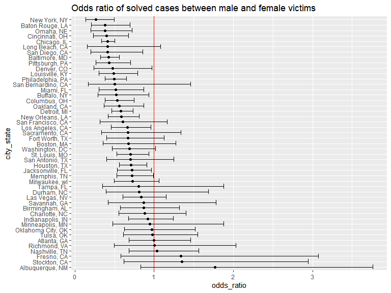
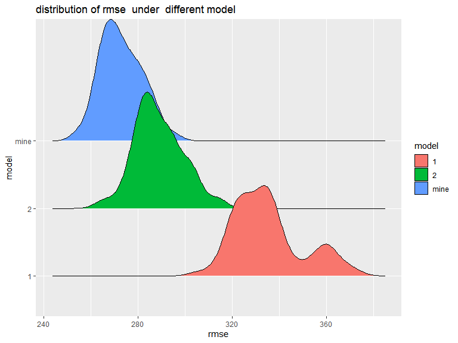

p8105_hw6_zj2357
================
Zekai Jin (zj2357)
2022-11-29

First of all, we should include the libraries we are using.

``` r
library(tidyverse)
library(p8105.datasets)
library(patchwork)
library(modelr)
library(ggridges)

knitr::opts_chunk$set(
  message  = FALSE,
  warning = FALSE,
  fig.width = 8, 
  fig.height = 6,
  out.width = "90%"
)
```

# Problem 1

Downloading the dataset

``` r
weather_df = 
  rnoaa::meteo_pull_monitors(
    c("USW00094728"),
    var = c("PRCP", "TMIN", "TMAX"), 
    date_min = "2017-01-01",
    date_max = "2017-12-31") %>%
  mutate(
    name = recode(id, USW00094728 = "CentralPark_NY"),
    tmin = tmin / 10,
    tmax = tmax / 10) %>%
  select(name, id, everything())
```

Bootstrap the 5000 samples and calculate the $\hat{r}^2$,
$log(\beta_0\times\beta_1)$

``` r
boot_straps = 
  tibble(
    strap_num = 1:5000,
    strap_samp = rerun(5000, sample_frac(weather_df, replace = TRUE))
  ) %>%
  mutate(
    models = map(.x = strap_samp, ~lm(tmax ~ tmin, data = .x)),
    beta = map(.x = models, ~pull(broom::tidy(.x), estimate)),
    rsq =  map(.x = models, ~pull(broom::glance(.x), r.squared)),
    beta_mult = map(beta, prod)
  ) %>%
  mutate(
      rsq = as.numeric(rsq),
      beta_log = log(as.numeric(beta_mult))
  ) %>%
  select(strap_num,rsq,beta_log) 
```

plot the distribution of $\hat{r}^2$ and $log(\beta_0\times\beta_1)$.

``` r
rsq_plot = 
  boot_straps %>%
  ggplot(aes(x = rsq)) +
  geom_density() +
  xlab("x square")+
  labs(title = "distribution of r_squred and log beta")

beta_plot = 
  boot_straps %>%
  ggplot(aes(x = beta_log)) +
  geom_density() +
  xlab("beta_0 times beta_1 ")

beta_plot + rsq_plot 
```


The following code calculates the Confidence Interval (CI) for the two
values based on normal distribution.

``` r
conf_int =
  boot_straps %>%
  pivot_longer(
    rsq:beta_log,
    names_to = "variable",
    values_to = "value"
  ) %>%
  group_by(variable) %>%
  summarise(
    lower_CI = quantile(value,0.025),
    higher_CI = quantile(value,0.975)
  )

conf_int
```

    ## # A tibble: 2 × 3
    ##   variable lower_CI higher_CI
    ##   <chr>       <dbl>     <dbl>
    ## 1 beta_log    1.97      2.06 
    ## 2 rsq         0.894     0.927

# Problem 2

Download and clean the homicide dataset.

``` r
rm(list = ls())

homi_df = 
  read_csv("data/homicide-data.csv") %>%
  mutate(
    city_state = str_c(city, ", ", state),
    solved = !disposition %in% c("Closed without arrest","Open/No arrest"),
    victim_age = as.numeric(victim_age)
  ) %>%
  filter(
    !city_state %in% c("Dallas, TX", "Phoenix, AZ", "Kansas City, MO", "Tulsa, AL"),
    victim_race %in% c("Black", "White")
  ) %>%
  select(uid,city_state,solved,victim_race, victim_age, victim_sex) %>%
  na.omit()
```

Do the logistic regression on `Baltimore, MD`.

``` r
logi_fit = 
  homi_df %>%
  filter(city_state == "Baltimore, MD") %>%
  glm(solved~ victim_race + victim_age + victim_sex, data = ., family = "binomial")

logi_fit %>%
  broom::tidy() %>%
  filter(term == "victim_sexMale") %>%
  mutate(
    odds_ratio = exp(estimate),
    conf_low = exp(estimate  - 1.96 * std.error),
    conf_high = exp(estimate + 1.96 * std.error)
  )  %>%
  select(term, odds_ratio, conf_low, conf_high)
```

    ## # A tibble: 1 × 4
    ##   term           odds_ratio conf_low conf_high
    ##   <chr>               <dbl>    <dbl>     <dbl>
    ## 1 victim_sexMale      0.426    0.325     0.558

Iterate over other cities with logistic regression.

``` r
logi_fit =
  homi_df %>%
  nest(data = c(uid, solved, victim_age, victim_race, victim_sex)) %>%
  mutate(
    model = map(.x = data, ~glm(solved ~ victim_race + victim_age + victim_sex, data = .x, family = "binomial")),
    estimate = map(.x  = model, ~filter(broom::tidy(.x), term == "victim_sexMale"))
  ) %>%
  unnest(estimate) %>%
  mutate(
    odds_ratio = exp(estimate),
    conf_low = exp(estimate  - 1.96 * std.error),
    conf_high = exp(estimate + 1.96 * std.error)
  )  %>%
  select(city_state, odds_ratio, conf_low, conf_high)

logi_fit
```

    ## # A tibble: 47 × 4
    ##    city_state      odds_ratio conf_low conf_high
    ##    <chr>                <dbl>    <dbl>     <dbl>
    ##  1 Albuquerque, NM      1.77     0.831     3.76 
    ##  2 Atlanta, GA          1.00     0.684     1.46 
    ##  3 Baltimore, MD        0.426    0.325     0.558
    ##  4 Baton Rouge, LA      0.381    0.209     0.695
    ##  5 Birmingham, AL       0.870    0.574     1.32 
    ##  6 Boston, MA           0.674    0.356     1.28 
    ##  7 Buffalo, NY          0.521    0.290     0.935
    ##  8 Charlotte, NC        0.884    0.557     1.40 
    ##  9 Chicago, IL          0.410    0.336     0.501
    ## 10 Cincinnati, OH       0.400    0.236     0.677
    ## # … with 37 more rows

Finally, plot the odds ratio between cities.

``` r
logi_fit %>%
  mutate(
    city_state = fct_reorder(city_state, -odds_ratio)
  ) %>%
  ggplot(aes(x = odds_ratio, y = city_state)) +
  geom_point() +
  geom_vline(aes(xintercept = 1), color = "red") +
  geom_errorbar(aes(xmin = conf_low, xmax = conf_high)) +
  labs(title = "Odds ratio of solved cases between male and female victims")
```



Thus, in most cities, after adjusting for race and age, cases with male
victims have more odds to be unsolved.

# Problem 3

Read and tidy the data. Since there are no missing values nor known
values, my main focus is to reformat some variables based on the
description.

``` r
rm(list = ls())

racelist = c("white","black", "asian", "puerto rican", "other", "unknown")
birth_df = 
  read_csv("data/birthweight.csv") %>%
  na.omit() %>%
  mutate(
    babysex = factor(babysex, levels = 1:2, labels = c("male","female")),
    frace = factor(frace, levels = c(1,2,3,4,8,9),labels = c("white","black", "asian", "puerto rican", "other", "unknown")),
    mrace = factor(mrace, levels = c(1,2,3,4,8),labels = c("white","black", "asian", "puerto rican", "other")),
    malform = factor(malform, levels = 0:1,labels = c("absent","present"))
  ) %>%
  select(bwt, everything())
```

I tried to build my model through step wise regression:

``` r
model_mine = step(lm(bwt ~ ., data = birth_df), direction = "both", trace = 0)

formula_mine = formula(model_mine)
formula_mine
```

    ## bwt ~ babysex + bhead + blength + delwt + fincome + gaweeks + 
    ##     mheight + mrace + parity + ppwt + smoken

Above is the optimal model the step wise regression found. Among the 19,
only 11 variables are selected. Save the formula for later use.

As required, make a residue plot:

``` r
birth_df %>%
  add_predictions(model_mine) %>%
  add_residuals(model_mine) %>%
  ggplot(aes(x = pred, y = resid)) +
  geom_point() +
  labs(title = "residue vs predicted outcomes")
```


We can see that the plot revealed some outliers and the variance across
predicted values are not equal. That indicates our model may not be the
best model.

To compare different models, use cross validation (CV). In this case, we
choose 10-fold CV since the dataset is large enough. Calculate the rmse
for each test on different models:

``` r
cv_df = 
  crossv_kfold(birth_df, k = 10) %>%
  mutate(
    train = map(train, as_tibble),
    test = map(test, as_tibble)
  ) %>%
  mutate(
    mod_mine = map(train, ~lm(formula_mine, data = .x)),
    mod_1 = map(train, ~lm(bwt ~ blength + gaweeks, data = .x)),
    mod_2 = map(train, ~lm(bwt ~ (bhead + blength + babysex)^3, data = .x))
  ) %>%
  mutate(
    rmse_mine = map2_dbl(mod_mine, test, ~rmse(model = .x, data = .y)),
    rmse_1 = map2_dbl(mod_1, test, ~rmse(model = .x, data = .y)),
    rmse_2 = map2_dbl(mod_2, test, ~rmse(model = .x, data = .y)),
  )
```

Finally, make a plot to show the distribution of rmse of different
models.

``` r
cv_df %>%
  select(.id, rmse_mine, rmse_1, rmse_2) %>%
  pivot_longer(
    rmse_mine:rmse_2,
    names_to = "model",
    names_prefix = "rmse_",
    values_to = "rmse"
  ) %>%
  ggplot(aes(x = rmse, y = model, fill = model)) +
  geom_density_ridges() +
  labs(title = "distribution of rmse  under  different model")
```



Obviously, our model have the lowest rmse among the three models.
However, it is a little bit concerning that it uses more parameters than
the other two.
